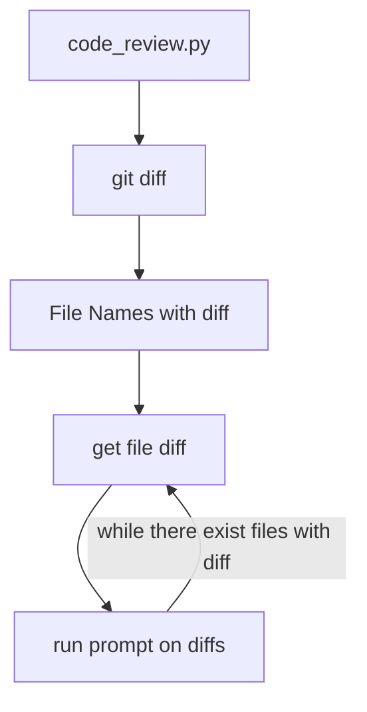

# pr_reviews

## code review

is a cli script to run a review prompt on your codebase changes.




### setup

#### Mac os (need apple silicon)

the requirement is very small just a m1, m2, m3, m4 with at least 16gb on ram space.

just take a note, rhe ram amount will determinate wich model you can use.

with 16 gb mac you can run:

- deepseek 7b
- llama 7b
- code llama 7b

```shell
brew install ollama
brew service start ollama
ollama pull <your model> # ej: ollama pull deppseek-ri:1.5b
```

mac already has a valid python version just install requests using your prefered way.

```shell
# simple way use pip

pip3 install requests
```

you are done just run `./code_review.py --dev-branch develop` or ` $PAHTTOREPO/code_review.py --dev-branch develop`
