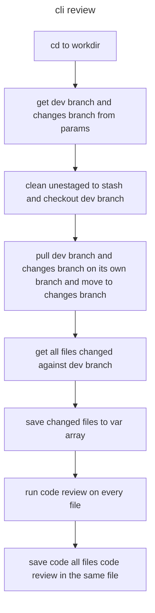
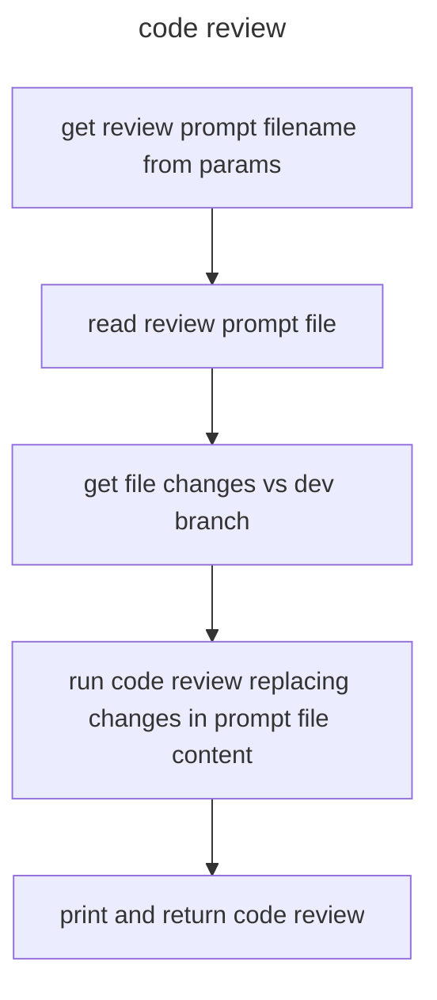

# code review cli

according diagrams below, giveme the code for the cli review and the code review function, considering all params should be defined on cli call. all using python and ollama api with codellama model.

## cli review

### code review function

